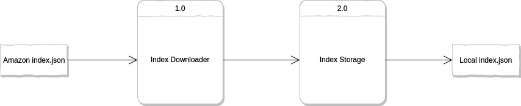
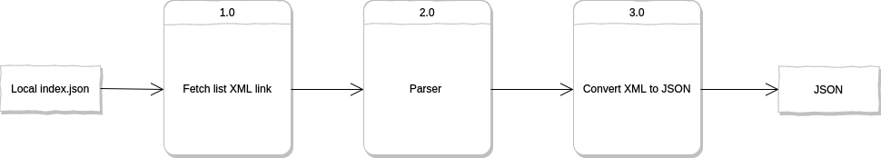
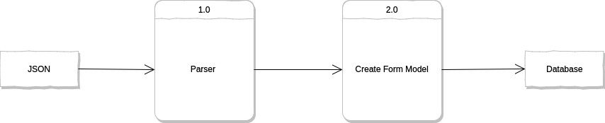

# Introduction

### Part 1. Background - What are Form 990s & Form 990xmls

Every year all charities in the United States must file their annual tax returns (i.e Form 990) electronically with the IRS. This process is known as "efiling" a tax return which is similar to individuals using TurboTax (and other tools) to file their tax returns. 

Form 990s are considered public documents (i.e. open for public inspection) and the IRS releases these efiled forms as XML files on the IRS website https://www.irs.gov/charities-non-profits/form-990-series-downloads

In 2023 Giving Tuesday partnered with CitizenAudit to build:
- A free public facing Datalake to host all past and current IRS Charity Data. 
- A set of ongling indices cataloging all available data (hosted in the Datalake)

The public data lake (files and indices) is available via AWS at arn:aws:s3:::gt990datalake-rawdata and the relevant documentation is here: [XXXXXXX]

### Part 2:  A Parser to Process Form 990 XMLs and store data into mongodb
 
This Package was designed to:

- Download (or process locally available) Json indices of the IRS Form 990 Xml Files created by Giving Tuesday and hosted on the Giving Tuessday 990 Charity Datalake
- Download Form 990 Xml Files referenced in each index (in prior step from the datalake)
- Parse IRS Form 990 Xml Files according to the mapping of 990 variables and paths found in the 990 Concordance Files into json documents. You can learn more about the concordance files here [XXXXXX]
- Store json documents into a non relational database (i.e. Mongodb).

**Core Package Components**:
- Helpers/Concordance_Files - Contain Mapping of Xml Variables/paths
- Parser - Controlled by XML_Parser.py which executes the parser
- Logger - Tracks any access,errors, and status/progress of parser.

Visual overview of parser steps (outlined above):

Step 1: Downloading & Storing Index from Giving Tuesday Data Lake



Step 2: Downloading, Parsing, & Converting XML documents to JSON documents



Step 3: Inserting JSON documents into Mongo


### Part 3. Technical Details

#### Technical Stack
    - Python 3.9 or later
    - Pip 21.0 or later
    - Virtualenv & Virtualenvwrapper (optional)

#### Python Libraries (per requirements.txt)
    aiohttp==3.8.1
    aiosignal==1.2.0
    async-timeout==4.0.2
    asynctest==0.13.0
    attrs==21.4.0
    certifi==2021.10.8
    charset-normalizer==2.0.10
    dnspython==2.2.1
    frozenlist==1.2.0
    idna==3.3
    idna-ssl==1.1.0
    lxml==5.1.0
    multidict==5.2.0
    pymongo==4.1.1
    requests==2.27.1
    typing_extensions==4.0.1
    urllib3==1.26.8
    yarl==1.7.2

#### Code Repository Directory Structure
```
Parser
├── Helpers   
│   ├── Database                           
│   │   ├── interface.py                    # Contains an interface class allowing us to load documents into mongo as well as perform other CRUD operations.
│   ├── Factory 
│   │   ├── formfactory.py                  # Imports 3 classes one for each form from form.py (below) with 1 interface for mongo
│   ├── Concordance_Files                   # Contains mappings
│   │   ├── mapping.csv                     # Concordance mapping file for all non table paths/variables of form 990s
│   │   ├── mapping_table.csv               # Concordance mapping file for all table paths/variables of form 990s
│   ├── Indices
│   │   ├── latest_only_0000-12-21.json     # Small sample index file for testing/debugging purposes
│   │   ├── latest_only_0000-12-21.json     # Small sample index file for testing/debugging purposes
│   ├── Model
│   │   ├── form.py                         # Constructs 3 Classes (1 per form type 990/990ez/990pf)  with one interface per form (via interface.py), each interface contains methods to access databases 
│   ├── Parser
│   │   ├── formparser.py                   # Each form parser is a class object with 4 initiated variables/objects and various methods used to parse xml
│   ├── helpers.py                          # Variety of helper methods used across library
│   ├── index_downloader.py                 # Helper methods used to download xml indices from Giving Tuesday Datalake 
│   ├── loggingutil.py                      # Logging library to help us log access, errors, and parser status/progress.
├── Images                                  # Series of graphic flowcharts inserted in the README.md file below
│   ├── Picture1.png  
│   │   ....
│   ├── Picture5.png  
├── Logs                                    # Storage of all logs generated during use of the script
├── Settings    
│   ├── Settings.py                         # All settings used across project.  
└── .gitignore                              # Lists files that will & will not be committed by git
└── README.md                               # Repo readme file (i..e what you are reading now)
└── Requirements.txt                        # Libraries required for Parser to work.
└── XML_Parser.py                           # This file is the main script (run from the commandline) it initiates downloads, updates, and insertions of files/forms.
```

### Part 4. Getting Started

#### Prerequirements
  - Ensure you have Python 3.9, Pip 21, & Virtualenv installed on your computer.
  - Ensure you have MongoDb installed locally or in a production/cloud environment
  - Ensure you have a database setup within MongoDb (we use irs_xml as our database name)
  - We recommend setting up 5 primary document collections within your database (we use: 990, 990EZ, 990PF, schdeules, schedulesb). 

#### Steps
   - Clone this github repository
   - Ensure you have the appropriate data folder structure. Its particularly important to have a helpers/indices and helpers/concordance_files
   - Create a Python Virtual Environment and install all requirements.txt with pip install -r requirements.txt
   - **Optional** Configure the following variables in settings/Settings.py: 
     - mongo_qa_details - make sure to point to your local mongodb instance details
     - mongo_production_details - make sure to point to your production details
     - schedules_reg_collection_name - name of your schedules collection for mongodb 
     - schedules_large_collection_name - name of your large schedules collection for mongodb (files greater than 16mb) 
     - mapping_main_file  - read faq below for more details
     - mapping_table_file - read faq below for more details

#### Using the Parser from The Command Line

Parser commands that can be passed from command line/terminal:

| Command        | Description                                                            | Default     |
| -------------- | ---------------------------------------------------------------------- | ----------- |
| -i {IndexName}      |Note: Json names from Giving Tuesday Datalake must follow one of the following | ----------- |
| |all_years_{year}-{month}-{date} json file extension is not needed|-----------|
| |latest_only_{year}-{month}-{date} json file extension is not needed|-----------|
| -f             | When processing removes and insert forms versus just inserting         | ----------- |
| -l {Number}    | Number of forms that will be inserted simultaneously                   | 1000        |
| -c {Number}    | Location from an index where you want to continue inserting/processing | ----------- |
| -u             | Update Index and insert new documents                                                          | ----------- |
| --mongodb      | Mongo                                                                  | ----------- |
| --qa           | Specifies the QA/Local Environment Mongo                               | ----------- |
| --prod         | Specifies the Production Environment                                  | ----------- |

**Commandline Examples:** 

- Insert xmls from the latest_only_0000-12-21.json index into production mongodb. 

```sh
$ python3 XML_Parser.py -i latest_only_0000-12-21 --prod --mongodb
```

- Insert xmls from the latest_only_0001-12-21.json index into qa mongodb.

```sh
$ python3 XML_Parser.py -i latest_only_0001-12-21 --qa --mongodb 
```

- Insert xmls from the latest_only_0001-12-21.json index into qa mongodb. Insert only 100 documents at a time.

```sh
$ python3 XML_Parser.py -i latest_only_0001-12-21 -l 100 --qa --mongodb
```

- Insert xmls from the latest_only_0001-12-21.json index using force insert - by deleting and reinserting the data (file by file) into production mongodb.

```sh
$ python3 XML_Parser.py -i latest_only_0001-12-21 -f --prod --mongodb
```

- Insert xmls from the latest_only_0001-12-21.json continuing from position 20 in the latest_only_0001-12-21.json index into production mongodb.

```sh
$ python3 XML_Parser.py -i latest_only_0001-12-21 -c 20 --prod --mongodb
```

- Insert multiple indices latest_only_0000-12-21 and latest_only_0001-12-21 into production monogodb.

```sh
$ python3 XML_Parser.py -i latest_only_0000-12-21.json latest_only_0001-12-21.json --prod --mongodb
```

- Process updated index latest_only_0001-12-21.json into production mongodb. For example presume index latest_only_0001-12-21.json has been updated, or modified. We need to then process and insert any new files into mongodb. 

```sh
$ python3 XML_Parser.py -u latest_only_0001-12-21 --prod --mongodb
```

### Part 5. FAQ & Troubleshooting
- Most Common Errors:
    - Incorrect parameters passed via commandline. 
        - Remember index names do not require .json file typing_extensions but if you are downloading from the GivingTuesday datalake you will need to use one of the following index naming conventions
            - all_years_{year}-{month}-{date}.json
            - latest_only_{year}-{month}-{date}.json
        - Remember to pass flags regarding location of indices local vs datalake or it will assume datalake and thus naming can fail.
    - Misconfigured Settings/settings.py
    - Missing concordance mapping files in helpers/concordance_files
      - You can learn more about the concordance files here:
        - https://nonprofit-open-data-collective.github.io/irs-efile-master-concordance-file/
        - https://github.com/Nonprofit-Open-Data-Collective/irs-efile-master-concordance-file
- User wants to leave parser running. 
    - Option 1. 
        - For Windows user use:  python3w filename.py the 'w' after Python tells interpreter to run code in background
            ```sh
            $ python3w XML_Parser.py -i latest_only_0001-12-21 --qa --mongodb
            ```
        - For Linux or mac users use: python3 filename.py &  Note: the "&"" sign will tell interpreter to run in background
            ```sh
            $ python3 XML_Parser.py & -i latest_only_0001-12-21 --prod --mongodb
            ```
    - Option 2.  
        - Use nohup which means dont terminate process when we logout of ssh or terminal session (there will be a nohup.out file created)
            ```sh
            $ nohup python3 XML_Parser.py -i latest_only_0001-12-21 --prod --mongodb
            ```
    - Option 3. Use Linux Screens google for tutorials.


### Part 6. References

